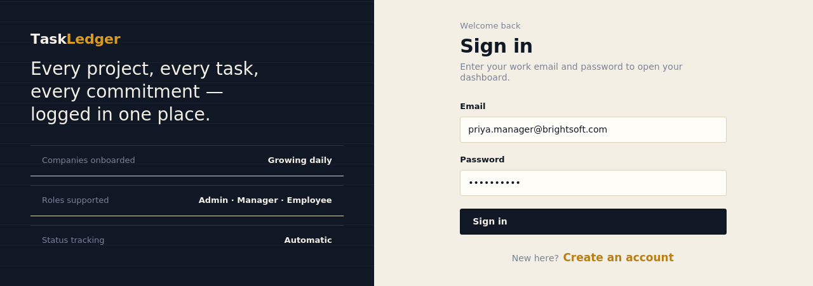
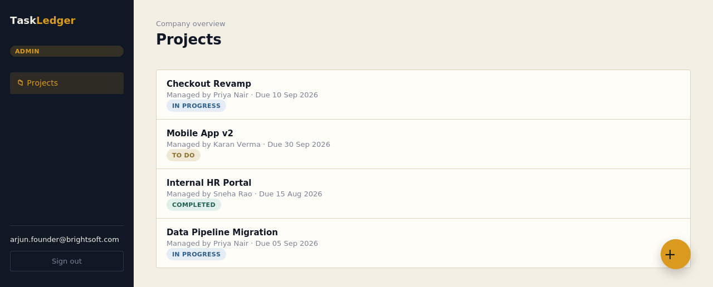
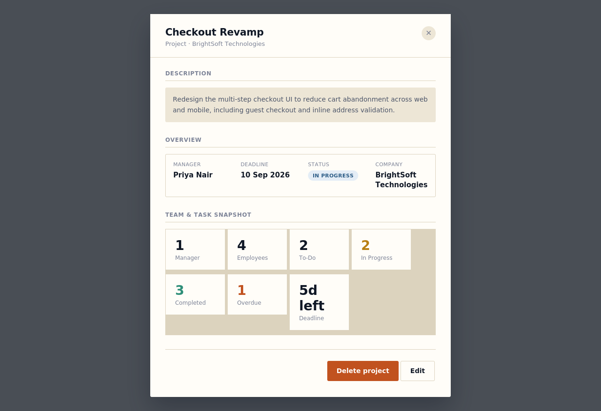
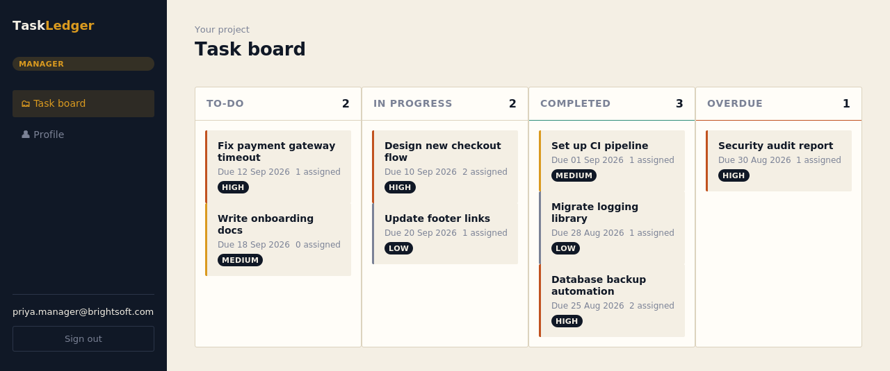
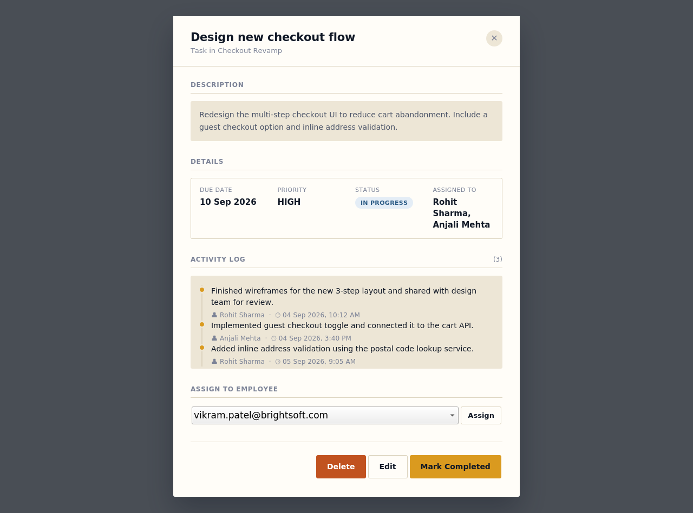
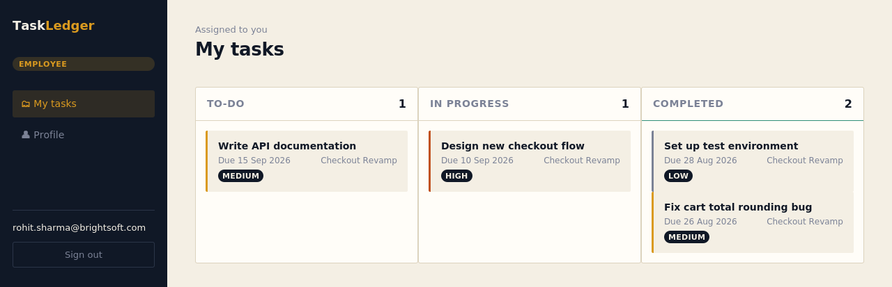
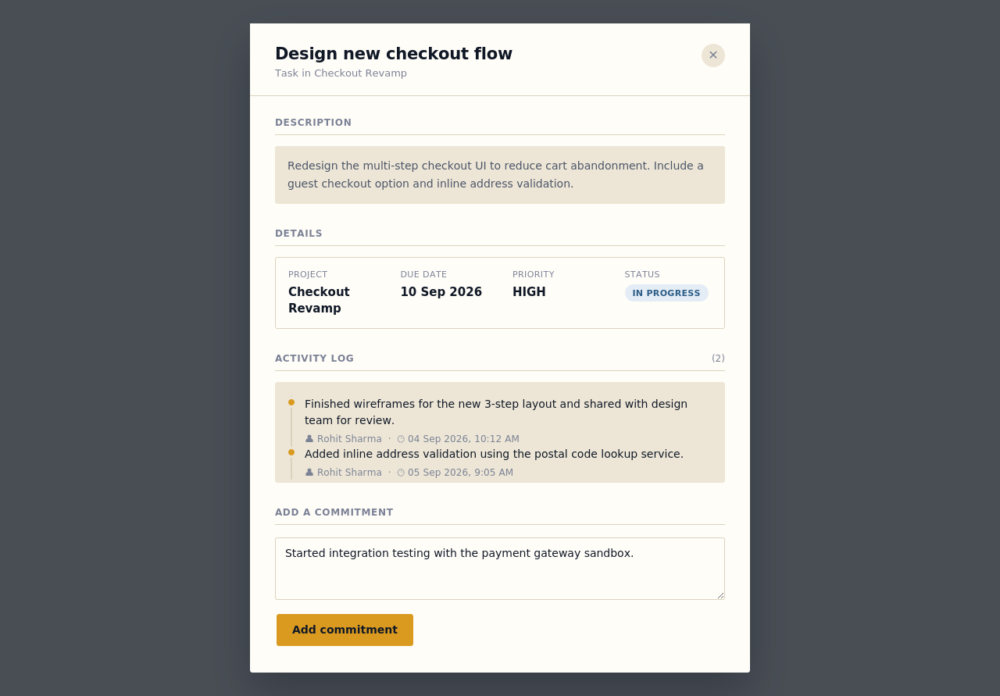

# 📋 TaskFlow — Multi-Tenant Task Management System

A full-stack **Task & Project Management System** built with **Spring Boot** and vanilla **JavaScript**, designed around three roles — **Admin, Manager, and Employee** — each with a purpose-built dashboard. Companies register, admins create projects and appoint managers, managers create and assign tasks, and employees log progress against them. Project status is calculated automatically as work moves through the pipeline.

> Built as a portfolio project to demonstrate REST API design, JWT-based role security, relational data modeling, and clean full-stack integration — without a frontend framework.

---

## 🖼️ Screenshots

> Screenshots live in a `screenshots/` folder at the project root (same level as this README).

| Login | Admin — Projects List |
|---|---|
|  |  |

| Admin — Project Detail | Manager — Task Board |
|---|---|
|  |  |

| Manager — Task Detail | Employee — Task Board |
|---|---|
|  |  |

| Employee — Task Detail |
|---|
|  |

---

## ✨ What This App Does

TaskFlow lets a **Company Admin** sign up their organization and run projects end-to-end:

- **Admin** registers the company, creates projects, appoints an existing employee as a project's **Manager**, and gets a live dashboard per project (task breakdown by status, overdue count, team headcount).
- **Manager** gets their own project's task board (To-Do / In Progress / Completed / Overdue), creates and edits tasks, and assigns them to employees on the team.
- **Employee** sees only the tasks assigned to them, and posts **Commitments** (progress updates / activity log entries) against a task — which automatically flips the task to *In Progress* the moment the first commitment lands.
- Project status (`TO_DO` → `IN_PROGRESS` → `COMPLETED`) is **derived automatically** from the status of its tasks — no one has to update it by hand.

### Core Features
- 🔐 JWT-based authentication with **role-based access control** (`ADMIN`, `MANAGER`, `EMPLOYEE`) enforced at the endpoint level with Spring Security `@PreAuthorize`.
- 🏢 Multi-tenant company model — every project, task, and employee is scoped to its own company; one company's admin can never see another's data.
- 📁 Full project & task CRUD with duplicate-name checks and deadline validation.
- 👥 Task assignment workflow (many-to-many between tasks and employees).
- 📝 Commitment/activity log system with pagination.
- 📊 Real-time dashboard stats for Admins (task counts by status, overdue tasks, team size) computed on demand.
- 🖥️ Three distinct, responsive dashboards (Admin / Manager / Employee) built with plain HTML/CSS/JS — no frontend framework, no build step.

---

## 🧱 Tech Stack

| Layer | Technology |
|---|---|
| Backend | Java 21, Spring Boot, Spring Web, Spring Data JPA |
| Security | Spring Security, JWT (`jjwt`) |
| Database | MySQL (via Hibernate/JPA) |
| Frontend | HTML5, CSS3, vanilla JavaScript (fetch API) |
| Build | Maven |

### Architecture at a glance
```
Controller  →  Service  →  Repository  →  MySQL
   ↑ REST DTOs        ↑ business rules      ↑ Spring Data JPA
   ↑ @PreAuthorize (role checks)
JWT filter validates every request before it reaches a controller
```

---

## 🗺️ API Overview

All endpoints are prefixed with `/api/task_management`.

| Resource | Endpoints | Who can call it |
|---|---|---|
| **User** | `POST /user/register`, `POST /user/login` | Public |
| **Company** | `POST /company` (register company + admin) | Public |
| **Employee** | `POST /employee`, `PUT /employee`, `GET /employee`, `GET /employee/emails` | Public (register) / Authenticated |
| **Project** | `POST /project`, `PUT /project`, `DELETE /project`, `GET /project/all`, `GET /project/{id}/dashboard`, `GET /project/{id}/tasks`, `GET /project/{id}/manager`, `GET /project/{id}/employees` | Admin |
| **Task** | `POST /task`, `PUT /task`, `DELETE /task`, `POST /task/assign`, `GET /task/all`, `GET /task/todo` \| `/inprogress` \| `/completed` \| `/overdue`, `POST /task/{id}` (mark complete) | Manager (mostly), Admin/Employee for reads |
| **Task (Employee view)** | `GET /task/employee/all`, `/todo`, `/inprogress`, `/completed` | Employee |
| **Commitments** | `POST /commitments`, `PUT /commitments`, `GET /commitments`, `DELETE /commitments` | Employee, Manager |

Every protected endpoint requires an `Authorization: Bearer <token>` header obtained from `POST /user/login`.

---

## 🚀 How to Run Locally

### Prerequisites
- Java 21+
- Maven 3.9+
- MySQL 8+ (running locally, or update the URL to point elsewhere)

### 1. Clone & configure
```bash
git clone <your-repo-url>
cd taskflow
```

Create a MySQL database:
```sql
CREATE DATABASE task_management;
```

### 2. Set environment variables
The app reads these from environment variables (see **"Where to edit before deploying"** below for the exact file/lines):

| Variable | Purpose | Example |
|---|---|---|
| `JWT_KEY` | Secret key used to sign JWT tokens | any long random string |
| `DB_PASSWORD` | Your MySQL password | `yourpassword` |

```bash
export JWT_KEY=your-super-secret-key
export DB_PASSWORD=yourpassword
```

### 3. Run the backend
```bash
./mvnw spring-boot:run
```
The API starts on **http://localhost:9090**.

### 4. Open the frontend
The frontend is served as static files from `src/main/resources/static`, so once the backend is running, just open:
```
http://localhost:9090/index.html
```
Register a company from there — the first user you create becomes that company's **Admin**.

---

## 🧪 How to Test the Functionality

**Manual walkthrough (recommended for a first look):**
1. Go to `/register.html` → register a new **Company** (this creates your Admin account).
2. Log in as Admin → note the **Company Code** shown on your dashboard.
3. Have a teammate (or a second browser tab, incognito) register as an **Employee** using that company code.
4. As Admin, create a **Project** and assign that employee as its **Manager**.
5. Log in as the Manager → create a **Task**, assign it to another employee in the company.
6. Log in as that **Employee** → open the task, add a **Commitment** → watch the task flip from *To-Do* to *In Progress* automatically.
7. Back in the Manager dashboard, mark the task **Completed** → once every task in the project is done, check the Admin dashboard: the project status updates to *Completed* on its own.

**API testing (Postman/Insomnia):**
- Import the endpoints listed above.
- Call `POST /api/task_management/user/login` first to get a JWT, then attach it as `Authorization: Bearer <token>` on every subsequent call.

---

## 🐞 Problems Solved / Fixes Made

This project went through a full backend + frontend audit and cleanup. Highlights:

- **Fixed a silent no-op delete bug** — `DELETE /project` accepted the request and returned success, but never actually deleted the project from the database.
- **Fixed missing `@Transactional` boundaries** on several service methods (`markItAsCompleted`, `updateTask`, `editCommits`, `changeStatus`) that could silently fail to persist changes — most importantly, the automatic "mark project as completed when all tasks are done" logic.
- **Replaced a nonsensical exception** (`AcceptPendingException`, an NIO channel exception being misused for authorization) with a proper `AccessDeniedException` in the commitments delete flow.
- **Rebuilt the global exception handler** so business-rule errors (duplicate project, invalid deadline, etc.) return `400 Bad Request` and authorization failures return `403 Forbidden`, instead of everything collapsing into a generic `500 Internal Server Error`.
- **Removed dead code**: an unused mapper method, an unused repository query, and an unreachable private helper.
- **Documented every service and repository method** with Javadoc comments describing exactly what each one does.
- **Fixed the Manager Dashboard header**, which hard-coded the text "Your Project" instead of showing the manager's actual project name — now pulled live from their profile.

---

## ☁️ Deploying to Render — Where to Edit

Before deploying, update the following:

1. **`src/main/resources/application.properties`**
   - `spring.datasource.url` — change from `jdbc:mysql://localhost:3306/task_management` to your hosted MySQL connection string (Render, PlanetScale, Railway, etc. all provide this).
   - `spring.datasource.username` — your DB username for that hosted instance.
   - Leave `spring.datasource.password=${DB_PASSWORD}` and `jwt.secret.key=${JWT_KEY}` as-is — **don't hardcode secrets here**. Set them as environment variables in Render's dashboard instead (**Environment → Add Environment Variable**):
     - `JWT_KEY`
     - `DB_PASSWORD`
   - `server.port=9090` — Render assigns its own dynamic `PORT` env variable. Change this line to `server.port=${PORT:9090}` so Render's port binding is respected.

2. **Render service setup**
   - Create a new **Web Service**, connect your GitHub repo.
   - Build command: `./mvnw clean package -DskipTests`
   - Start command: `java -jar target/*.jar`
   - Add the environment variables from step 1.
   - Provision a MySQL database (a managed MySQL add-on, or an external free-tier provider like Aiven/Railway) and plug its connection URL/credentials into the same environment variables.

3. **CORS / frontend origin** — only relevant if you later split the frontend into its own separately-hosted app instead of serving it from `static/`. If so, update `SecurityConfiguration.java` to allow your deployed frontend's origin.

Once deployed, your live app will be reachable at the Render-provided URL, e.g. `https://taskflow.onrender.com/index.html`.

---

## 📂 Project Structure
```
src/main/java/com/app/taskmanagement/
├── controller/         REST endpoints
├── services/           Business logic
├── repository/         Spring Data JPA repositories
├── entity/              JPA entities (User, Employee, Company, Projects, Task, Commitments)
├── enums/               Role, Status
├── requestdto/          Incoming request payloads
├── responsedto/         Outgoing response payloads
├── config/              Spring Security configuration
├── utils/               JWT filter/service, Mapper, logging aspect
└── exceptionhandler/     Centralized error handling

src/main/resources/
├── application.properties
└── static/               Vanilla JS/HTML/CSS frontend (index, register, admin, manager, employee)
```

---

## 📄 License
This project is open-sourced for portfolio/demonstration purposes.
